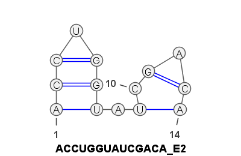

# RNA-secondary-structure-prediction

This program predicts the secondary structure of a RNA sequence
using CLINGO and maximizing two possible Energy functions. It also generates an image 
of the resulting structure using VARNA applet. Java is needed to run VARNA applet
More information about VARNA applet in

* http://varna.lri.fr/index.php?lang=en&page=home&css=varna


Based on 'Exploring Life through Logic Programming: Logic Programming in Bioinformatics -  RNA secondary  structure prediction' available in 
 
 * https://computerscience.nmsu.edu/_files/documents/TR-CS-NMSU-2014-10-24.pdf


# Requirements

 * **Clingo**: no additional installations are required to use clingo. You can find the executable binary (v5.4) for Windows, Linux and MacIos in 'clingo/bin/{system platform}/clingo' if not installed in your system.

 * **VARNA applet**: in order to use this applet, **java** is required.

 # Repository Structure
  * **rna_prediction**.py: python script with a pipeline to predict a secondary structure given a sequence and a cost function to use and outputs statistics and images of the structure
  * **clingo**: folder containing all clingo facilities, codes and files.
    * **bin**: folder containing clingo binaries.
    * **input**: folder containing the input file of the program.
        * **rna_ss_input.lp**: input file. RNA sequences must be represented as facts of the form seq(id, base)
    * **output**: folder containing output files of clingo executions when using the python script. 
    * **rna_ss_prediction_base.lp**: clingo lp core file. Computes the possible secondary structure models given the sequence in **rna_ss_input.lp**.
    * **rna_ss_prediction_E1**: given the models in **rna_ss_prediction_base.lp**, maximizes the number of pairings (Nussinov Energy cost Function). 
     * **rna_ss_prediction_E2**: given the models in **rna_ss_prediction_base.lp**, minimizes $E_2$ cost function.
     * **rna_ss_prediction_E2_0**: given the models in **rna_ss_prediction_base.lp**, minimizes $E_2$ cost function in its original implementation found in the reference paper.

 * **VARNA**: folder containing the VARNA applet jar.
 * **generated_images**: folder containing generated images when using the python script
 * **stats_output**: folder containing report files about predictions when using the python script.

 # Python script usage
This scripts has two mandatory parameters:
 * *sequence*: RNA sequence in text form (Example: AGUCCA)
 * *energy*: integer to specify which cost function will be used. 
    * if 0: uses the original implementation of $E_2$ found in  **rna_ss_prediction_E2_0**
    * if 1: uses Nussinov's cost function $E_1$ found in  **rna_ss_prediction_E1**
    * if 2: uses my implementation of $E_2$ found in  **rna_ss_prediction_E2**

If needed, type the following for help.

    python rna_prediction.py -h

```
usage: rna_prediction.py [-h] sequence energy

Secondary structure prediction of a RNA sequence with image generation.

positional arguments:
  sequence    RNA sequence [example: ACCGUA]
  energy      energy function used [possible values 1, 2 and 0]. Value 0 uses the original E2 function of the authors

optional arguments:
  -h, --help  show this help message and exit
```

## Notes
 * The script automatically detects your platform and runs the version of clingo you require, so you don't have to worry about the bin folder or which clingo executable you have to use.
 * The script automatically checks if java is installed. If not, VARNA applet is not executed and no image is generated.

## Pipeline
To understand the execution of the scripts and the generated files let's see an example. We will compute the secondary structure of the sequence ACCUGGUAUCGACA using my implementation of $E_2$ cost function:

    python rna_prediction.py ACCUGGUAUCGACA 2

 1. The script generates the input file **clingo\input\rna_ss_input.lp**
 2. Runs **rna_ss_prediction_E2** (in this case) and saves the output in **clingo\output\rna_ss_prediction_E2_ACCUGGUAUCGACA.txt**

 ```
clingo version 5.4.0
Reading from clingo\rna_ss_prediction_E2.lp
Solving...
Answer: 1
seq(1,a) seq(2,c) seq(3,c) seq(4,u) seq(5,g) seq(6,g) seq(7,u) seq(8,a) seq(9,u) seq(10,c) seq(11,g) seq(12,a) seq(13,c) seq(14,a) contacts(0) energy2(1400) c1(100)
Optimization: 1400

...

Answer: 8
seq(1,a) seq(2,c) seq(3,c) seq(4,u) seq(5,g) seq(6,g) seq(7,u) seq(8,a) seq(9,u) seq(10,c) seq(11,g) seq(12,a) seq(13,c) seq(14,a) pairing(9,14) pairing(14,9) pairing(11,13) pairing(13,11) pairing(1,7) pairing(7,1) pairing(2,6) pairing(6,2) pairing(3,5) pairing(5,3) contacts(10) c1(70) energy2(80)
Optimization: 80
OPTIMUM FOUND

Models       : 8
  Optimum    : yes
Optimization : 80
Calls        : 1
Time         : 0.441s (Solving: 0.14s 1st Model: 0.03s Unsat: 0.05s)
CPU Time     : 0.438s
 ```
 3. Reads the previous output file and parse the result to generate a report and the input needed for VARNA applet. This file is generated in **stats_output\STATS_ACCUGGUAUCGACA_E2.txt**

 ```
 STATS OF SEQUENCE: E2 - ACCUGGUAUCGACA
================================================================================
PAIRING DICTIONARY:                      {9: 14, 11: 13, 1: 7, 2: 6, 3: 5}        
SEQUENCE STRING:                         ACCUGGUAUCGACA                           
PARENTHESIS AND DOTS CONNECTION STRING:  (((.))).(.(.))                           
================================================================================
                     PREDICTED            EXPECTED            
SEQUENCE LENGTH:     14.00                -                   
NUM. PAIRINGS:       5.00                 -                   
NUM. PAIRED BASES:   10.00                -                   
NUM. CG PAIRINGS:    3.00                 -                   
NUM. AU PAIRINGS:    2.00                 -                   
NUM. GU PAIRINGS:    0.00                 -                   
PROP.  CG PAIRINGS:  0.60                 0.53                
PROP.  AU PAIRINGS:  0.40                 0.35                
PROP.  GU PAIRINGS:  0.00                 0.12                
BEST C1 FOUND:       70.00                -      
 ```

 4. If java is installed, runs VARNA applet to generate the image of the structure in **generated_images\ACCUGGUAUCGACA_2.png**

<p align="center">
 
<p>

# About $E_2$

I have found several issues with the original implementation of $E_2$ cost function in the reference paper:
 * Unbalanced units: the weigth $c_1$ is not multiplied by 100 like the others.
 * Incoherent usage of $|P|$: confusion between $|P|$ (number of paired bases) and $|P|/2$ (number of pairings).
 * Maximization of cost function instead of minimazing it.

After that, I have tried the following simple cost function to minimize:

$$
\begin{align*}
    E_2 & = \left|c_1N - |P|\right|+\left|AU-0.35\frac{|P|}{2}\right|+\left|CG-0.53\frac{|P|}{2}\right|,
\end{align*}
$$

where $N$ is the length of the sequence, $AU$ and $CG$ are the number of pairings of type AU and CG and $c_1$ is a learnable parameter that represents the proportion of total paired bases. By minimizing this function, we hope to adjust the structure to the experimental distribution of pairings.

# Note
Depending of the cost function used, this problem has time complexity between $O(n^2)$ and $O(n^4)$, so be careful with sequences longer than the provided examples if you don't want to wait hours.